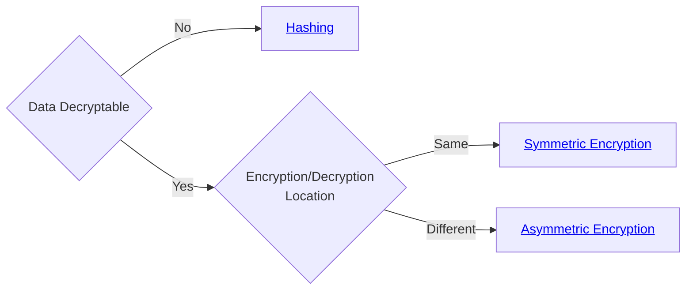

# Glossary

How to determine the kind of encryption you should use.

## 🌲 Decision Tree

## 📚 Libraries

Always use a well-known library for encryption. Avoid rolling your own.

- [`NaCl`](https://nacl.cr.yp.to/)
- [`libsodium`](https://github.com/jedisct1/libsodium)
- [`monocypher`](https://github.com/LoupVaillant/Monocypher)

## Symmetric vs Asymmetric

|                  | Symmetric | Asymmetric     |
| ---------------- | --------- | -------------- |
| **Key**          | Shared    | Public/Private |
| **Speed**        | Fast      | Slow           |
| **Length Limit** | Long      | Short          |
| **Use Case**     | Bulk Data | Key Exchange   |
