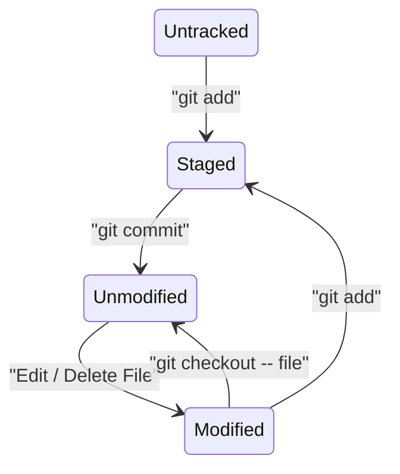

import GitHubBadge from "@site/src/components/GitHubBadge";

# `git`

Quick reference for `git` commands.

:::tip

Try [Learn Git Branching](https://learngitbranching.js.org/) to learn Git interactively.

:::

## File State Diagram



## Snippets

:::warning

Some of the snippets changes commit history. Use with caution.

:::

### Stage case-sensitive file changes

```bash
git mv --force old_name NEW_NAME
```

### Remove commits after a certain commit

```bash
git rebase --committer-date-is-author-date -i <commit-hash>^
```

### Reset author

1. Configure the author name and email. (Add `--global` to set the author globally.)

```bash
git config user.name "New Author Name"
git config user.email "<email@address.example>"
```

2. Rewrite the commit history.

```bash
git rebase -r '<since-commit-hash>' --exec 'git commit --amend --no-edit --reset-author'
```

or from the top

```bash
git rebase -r --root --exec 'git commit --amend --no-edit --reset-author'
```

### Remove ignored files from local file system

This resets the local file system to a clean state. e.g. Remove installed `node_modules` or built files.

```bash
git clean -fdX
```

### Remove checked-in ignored files

1. Update `.gitignore` to exclude the files.
2. Remove the files from the repository.

```bash
git rm --cached `git ls-files -i -c --exclude-from=.gitignore`
```

3. Commit the changes.

### Undo a commit

```bash
git reset --soft HEAD~1
```

To discard the changes:

```bash
git reset --hard HEAD~1
```

### Commited to the wrong branch

:::warning

You'll need to force push the changes if the commit is already pushed.

:::

1. Create a new branch from the commit.

```bash
git branch new-branch
```

2. Update the current branch to the previous commit.

```bash
git reset HEAD~ --hard
```

3. Switch to the new branch.

```bash
git checkout new-branch
```

### Update author and committer of the latest commit

```bash
git commit --amend --no-edit --reset-author --date="$(git show -s --format=%ci HEAD)"
```

Note: This will update commit timestamp, in most case, you should.

### Wipe files from the history

There's a git command called `filter-branch`, but <GitHubBadge slug="newren/git-filter-repo" /> is a faster, safer modern alternative.

1. Filter the branch to remove the file from the entire history.

```bash
git filter-repo --path-glob '*.png' --invert-paths
```

2. Re-add your origin back if it is removed by `git-filter-repo`
3. Push the changes to the remote repository.

```bash
git push --force-with-lease
```

## References

- [Oh Shit, Git!?!](https://ohshitgit.com/): Some useful snippets
- [Beej's Guide to Git](https://beej.us/guide/bggit/html/split-wide/): A comprehensive, but not too detailed handbook
