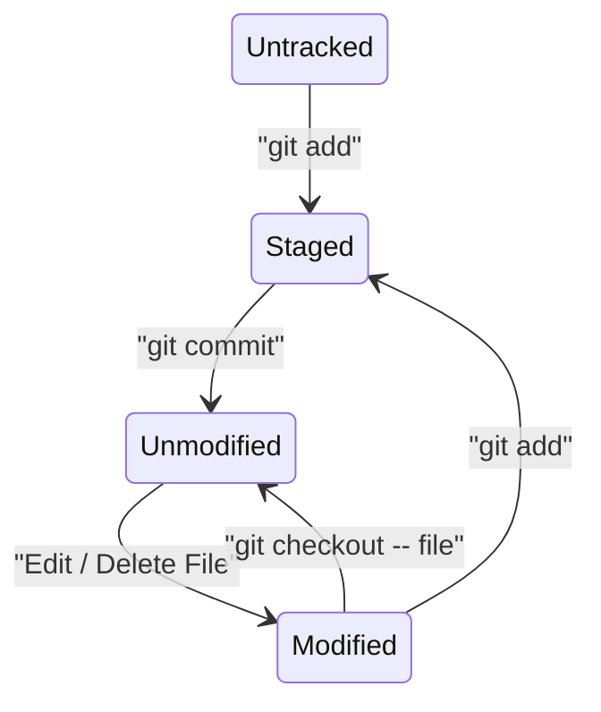

import GitHubBadge from "@site/src/components/GitHubBadge";

# `git`

Quick reference for `git` commands.

:::tip

Try [Learn Git Branching](https://learngitbranching.js.org/) to learn Git interactively.

:::

## File State Diagram



## Commands

- 📄 means the command is built-in.
- 🎁 means the command is customized in-house.
- ✚ means the command is available from [tj/git-extras](https://github.com/tj/git-extras).
- ⛓️ means the command is available from [nvie/git-toolbelt](https://github.com/nvie/git-toolbelt).

| Subcommand     | Docs                                                                              | Description                                                                   |
| -------------- | --------------------------------------------------------------------------------- | ----------------------------------------------------------------------------- |
| `abort`        | [✚](https://github.com/tj/git-extras/blob/main/Commands.md#git-abort)             | Abort a revert, rebase, merge or cherry-pick                                  |
| `alias`        | [✚](https://github.com/tj/git-extras/blob/main/Commands.md#git-alias)             | Define, search and show aliases                                               |
| `archive-file` | [✚](https://github.com/tj/git-extras/blob/main/Commands.md#git-archive-file)      | Zip the repository                                                            |
| `authors`      | [✚](https://github.com/tj/git-extras/blob/main/Commands.md#git-authors)           | Generate an AUTHORS file                                                      |
| `browse`       | [✚](https://github.com/tj/git-extras/blob/main/Commands.md#git-browse)            | Open the repository in the browser                                            |
| `browse-ci`    | [✚](https://github.com/tj/git-extras/blob/main/Commands.md#git-browse-ci)         | Open the CI pipeline in the browser                                           |
| `brv`          | [✚](https://github.com/tj/git-extras/blob/main/Commands.md#git-brv)               | Pretty-print branches with their last commit                                  |
| `changelog`    | [✚](https://github.com/tj/git-extras/blob/main/Commands.md#git-changelog)         | Generate a HISTORY/CHANGE file content                                        |
| `clear`        | [✚](https://github.com/tj/git-extras/blob/main/Commands.md#git-clear)             | Clear unstage changes and remove untracked files (**includes** ignored files) |
| `clear-soft`   | [✚](https://github.com/tj/git-extras/blob/main/Commands.md#git-clear-soft)        | Clear unstage changes and remove untracked files (excludes ignored files)     |
| `count`        | [✚](https://github.com/tj/git-extras/blob/main/Commands.md#git-count)             | Count the number of commits                                                   |
| `extras`       | [✚](https://github.com/tj/git-extras/blob/main/Commands.md#git-extras)            | Show the man page of `git-extras`                                             |
| `fork`         | [✚](https://github.com/tj/git-extras/blob/main/Commands.md#git-fork)              | Fork and clone a repository                                                   |
| `ignore`       | [✚](https://github.com/tj/git-extras/blob/main/Commands.md#git-ignore)            | Show ignored patterns                                                         |
| `ignore-io`    | [✚](https://github.com/tj/git-extras/blob/main/Commands.md#git-ignore-io)         | Generate `.gitignore` from gitignore.io                                       |
| `lock`         | [✚](https://github.com/tj/git-extras/blob/main/Commands.md#git-lock)              | Lock a file from being changed in the repository                              |
| `locked`       | [✚](https://github.com/tj/git-extras/blob/main/Commands.md#git-lock)              | List all locked files                                                         |
| `obliterate`   | [✚](https://github.com/tj/git-extras/blob/main/Commands.md#git-obliterate)        | Remove a file from the entire history of a git repository                     |
| `root`         | [⛓️](https://github.com/nvie/git-toolbelt/blob/main/README.md#git-root--git-repo) | Show the root directory of the repository                                     |
| `summary`      | [✚](https://github.com/tj/git-extras/blob/main/Commands.md#git-summary)           | Show commit summary                                                           |
| `show-tree`    | [✚](https://github.com/tj/git-extras/blob/main/Commands.md#git-show-tree)         | Show commit tree                                                              |
| `standup`      | [✚](https://github.com/tj/git-extras/blob/main/Commands.md#git-standup)           | Show a user's contributions in the past n days                                |
| `unlock`       | [✚](https://github.com/tj/git-extras/blob/main/Commands.md#git-unlock)            | Unlock a file from being changed in the repository                            |

## Snippets

:::warning

Some of the snippets changes commit history. Use with caution.

:::

### Stage case-sensitive file changes

```bash
git mv --force old_name NEW_NAME
```

### Remove commits after a certain commit

```bash
git rebase --committer-date-is-author-date -i <commit-hash>^
```

### Reset author

1. Configure the author name and email. (Add `--global` to set the author globally.)

```bash
git config user.name "New Author Name"
git config user.email "<email@address.example>"
```

2. Rewrite the commit history.

```bash
git rebase -r '<since-commit-hash>' --exec 'git commit --amend --no-edit --reset-author'
```

or from the top

```bash
git rebase -r --root --exec 'git commit --amend --no-edit --reset-author'
```

### Remove ignored files from local file system

This resets the local file system to a clean state. e.g. Remove installed `node_modules` or built files.

```bash
git clean -fdX
```

### Remove checked-in ignored files

1. Update `.gitignore` to exclude the files.
2. Remove the files from the repository.

```bash
git rm --cached `git ls-files -i -c --exclude-from=.gitignore`
```

3. Commit the changes.

### Undo a commit

```bash
git reset --soft HEAD~1
```

To discard the changes:

```bash
git reset --hard HEAD~1
```

### Commited to the wrong branch

:::warning

You'll need to force push the changes if the commit is already pushed.

:::

1. Create a new branch from the commit.

```bash
git branch new-branch
```

2. Update the current branch to the previous commit.

```bash
git reset HEAD~ --hard
```

3. Switch to the new branch.

```bash
git checkout new-branch
```

### Update author and committer of the latest commit

```bash
git commit --amend --no-edit --reset-author --date="$(git show -s --format=%ci HEAD)"
```

Note: This will update commit timestamp, in most case, you should.

### Wipe files from the history

There's a git command called `filter-branch`, but <GitHubBadge slug="newren/git-filter-repo" /> is a faster, safer modern alternative.

1. Filter the branch to remove the file from the entire history.

```bash
git filter-repo --path-glob '*.png' --invert-paths
```

2. Re-add your origin back if it is removed by `git-filter-repo`
3. Push the changes to the remote repository.

```bash
git push --force-with-lease
```

## References

- [Oh Shit, Git!?!](https://ohshitgit.com/): Some useful snippets
- [Beej's Guide to Git](https://beej.us/guide/bggit/html/split-wide/): A comprehensive, but not too detailed handbook
