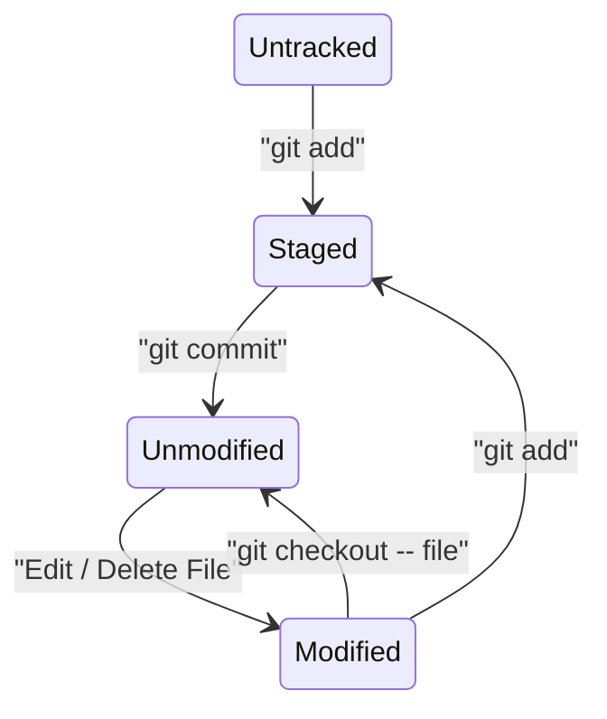

# `git`

Quick reference for `git` commands.

:::tip

Try [Learn Git Branching](https://learngitbranching.js.org/) to learn Git interactively.

:::

## File State Diagram

```mermaid
stateDiagram
    Untracked --> Staged : "git add"
    Staged --> Unmodified : "git commit"
    Unmodified --> Modified : "Edit / Delete File"
    Modified --> Staged : "git add"
    Modified --> Unmodified : "git checkout -- file"
```
