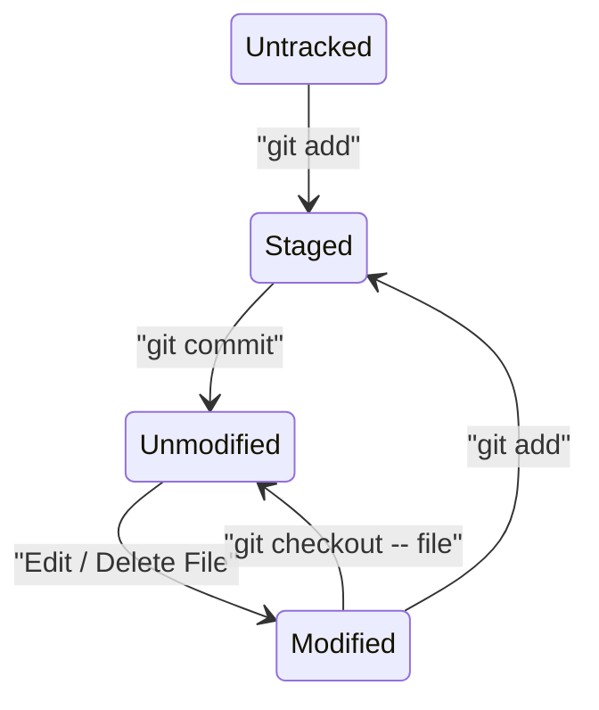

import { Icon } from "@iconify/react";
import GitHubBadge from "@site/src/components/GitHubBadge";

# <Icon icon="logos:git-icon" inline={true} /> Git

Everything about `git`

## File State Diagram

## Signing

You can sign commits, tags, objects, and even push to certify your identity.

There are three ways to sign, specified by the `gpg.format` configuration variable:

- `openpgp`: Use OpenPGP keys, the default.
- `ssh`: Use SSH keys, the easiest.
- `x509`: Use X.509 certificates, mostly used in enterprise.

If you're using x.509, just follow your organization's instructions. For the rest of us, just use SSH.

Regardless of `openpgp` or `ssh`, always follow the "One key per device" principle.

## References

- [Learn Git Branching](https://learngitbranching.js.org/): An interactive Git tutorial
- [Beej's Guide to Git](https://beej.us/guide/bggit/html/split-wide/): A comprehensive, but not too detailed handbook
