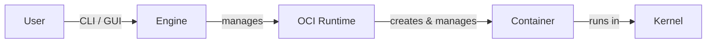

import GitHubBadge from "@site/src/components/GitHubBadge";

# 🚢 Containerization

Everything worth-noting for containerization.

## Runtime

Low-level CLI that implements the OCI Runtime Specification <GitHubBadge slug="opencontainers/runtime-spec" />. Responsible for actually starting the container on system.

You wouldn't typically directly operate on those.

|                                                        | Overhead        | Safety                | Written in | Notes                                                                                 |
| ------------------------------------------------------ | --------------- | --------------------- | ---------- | ------------------------------------------------------------------------------------- |
| <GitHubBadge slug="opencontainers/runc" />             | Baseline        |                       | Go         | The OG from Docker. Now seperate as a component that also serves many other runtimes. |
| <GitHubBadge slug="containers/crun" />                 | Lower           |                       | C          |                                                                                       |
| <GitHubBadge slug="kata-containers/kata-containers" /> | Slightly higher | Fully isolated kernel |            |                                                                                       |

## Engines

| Engine                                        | CLI                                       | GUI                                                  | Default runtime            | Rootless        | Pod abstraction | Systemd support | Notes                                        |
| --------------------------------------------- | ----------------------------------------- | ---------------------------------------------------- | -------------------------- | --------------- | --------------- | --------------- | -------------------------------------------- |
| <GitHubBadge slug="moby/moby" /> (`dockerd`)  | <GitHubBadge slug="docker/cli" />         | Docker Desktop                                       | `runc`                     | ⚠️ Experimental | ❌              | ❌              |                                              |
| <GitHubBadge slug="containers/podman" />      | `podman`                                  | <GitHubBadge slug="podman-desktop/podman-desktop" /> | `crun`                     | ✅              | ✅              | ✅              |                                              |
| <GitHubBadge slug="containerd/containerd" />  | <GitHubBadge slug="containerd/nerdctl" /> | -                                                    | `runc`                     |                 |                 |                 | There's also a low-level CLI called `ctr`    |
| <GitHubBadge slug="cri-o/cri-o" />            | `crictl` from Kubernetes                  | -                                                    | `runc`                     |                 |                 |                 | Used by Kubernetes, not meant for direct use |
| <GitHubBadge slug="apple/containerization" /> | <GitHubBadge slug="apple/container" />    | -                                                    | `Virtualization.framework` |                 |                 |                 |                                              |

Although the CLI is different, but they have similar usage as docker.

There's also <GitHubBadge slug="rancher-sandbox/rancher-desktop" /> that can operates `dockerd` or `containerd` and managing Kubernetes.

## Base Image

{/* TODO */}

- <GitHubBadge slug="gliderlabs/docker-alpine" />
- <GitHubBadge slug="phusion/baseimage-docker" />

## Misc

- <GitHubBadge slug="abiosoft/colima" />: A docker alternative that built on top
  of <GitHubBadge slug="lima-vm/lima" />. Actually VM, not containers.
