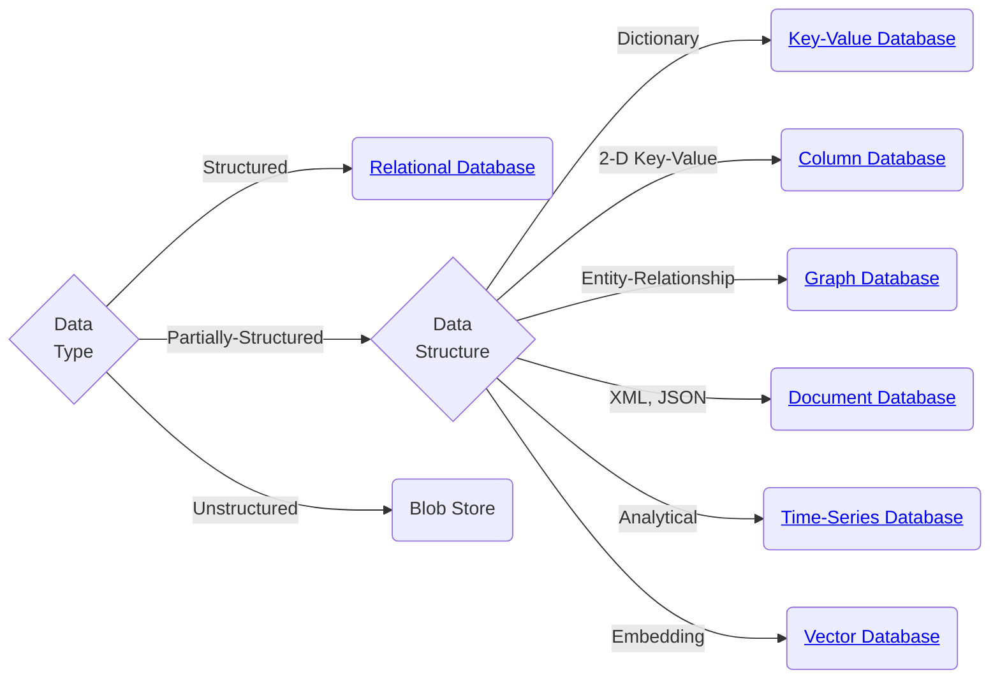

import Image from "@site/src/components/TomyImage";

# 🗃️ Database

Some general concepts and ideas about databases and how to choose the right one.

## 🌳 Decision Tree

## Categories by Workloads

- <abbr title="Online Transaction Processing">OLAP</abbr>: Write Heavy
- <abbr title="Online Analytical Processing">OLTP</abbr>: Read Havy
- <abbr title="Hybrid Transaction + Analytical Processing">HTAP</abbr>: A mix of
  both the above

## Storage Models

- <abbr title="N-Ary Storage Model">NSM</abbr>: Store all attributes of a tuple
  in the same page
- <abbr title="Decomposition Storage Model">DSM</abbr>: Store each attribute of
  a tuple in different page
- <abbr title="Partition Attributes Across">PAX</abbr>: A mix of both the above

## ACID

- **A**tomicity: All or nothing. If a transaction fails, the database is rolled back to its previous state.
- **C**onsistency: If the transaction starts in a consistent state, it ends in a consistent state.
- **I**solation: Transactions are isolated from each other. Changes made by other transactions are not visible to the current transaction.
- **D**urability: Once a transaction is committed, it is permanent. Permanent means its effects are there even if the system crashes.

## CAP

Consistent, Available, and Partition Tolerant

## Serializability

<Image
  filename="database-universe-of-schedules.png"
  alt="A diagram titled 'Universe of Schedules,' displaying nested relationships among different types of database schedules. The outermost box is labeled 'All Schedules,' containing subsets: 'View Serializable,' 'Conflict Serializable,' and 'Serial.' 'No Cascading Aborts' and 'Strong Strict 2PL' overlap some of these categories. The hierarchy highlights how certain scheduling properties are stricter than others."
></Image>

## Isolation Levels

Different isolation levels may suffer from different types of anomalies:

- **Dirty Read**: A transaction may reads uncommitted changes from another transaction.
- **Unrepeatable Read**: A transaction reads the same row twice but gets different values because another transaction modified and committed it in between.
- **Lost Updates**: Two transactions read the same data and update it, but one overwrites the other’s changes, losing data.
- **Phantom Reads**: A transaction reads a set of rows, but when it reads again, new rows appear because another transaction inserted or deleted data.

| Level            | Dirty Read | Unrepeatable Read | Lost Updates | Phantom Reads | Usage                               |
| ---------------- | ---------- | ----------------- | ------------ | ------------- | ----------------------------------- |
| Serializable     | No         | No                | No           | No            | SQLite's Default[^1]                |
| Repeatable Read  | No         | No                | No           | Maybe         | MySQL's Default                     |
| Read Committed   | No         | Maybe             | Maybe        | Maybe         | PostgreSQL & Oracle's Default       |
| Read Uncommitted | Maybe      | Maybe             | Maybe        | Maybe         | Almost Never, but MySQL supports it |

[^1]: In practice, it behaves like Read Committed.

## Indexes

- Clustered index: Data is being stored in the same order as the index, and can be used to retrieve data directly
- Non-clustered index: Data is stored separately from the index, and the index contains pointers to the data

## Miscellaneous

- Choosing page size:
  - Many large reads: large page size
  - Many small writes: small page size

## Aggregation

- Sorting: Sort the data and then aggregate
- Hashing: Hash the data and then group by hash

Hashing is always more efficient unless the data is already sorted beforehand (e.g. with `ORDER BY`).

## References

- [DB-Engines](https://db-engines.com)
- [Database of Databases](https://dbdb.io)
- [CMU 15-445/645 Database Systems](https://15445.courses.cs.cmu.edu/fall2024/)
