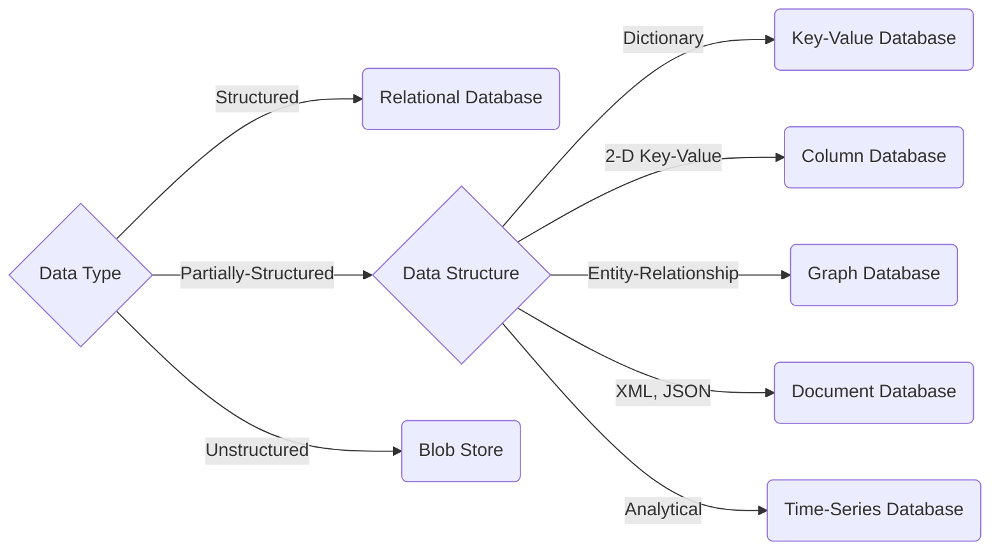

# Glossary

## Decision Tree

```mermaid
graph LR

A{Data Type}
A --Structured--> B(Relational Database)
A --Partially-Structured--> C{Data Structure}
  C --Dictionary--> E(Key-Value Database)
  C --2-D Key-Value--> F(Column Database)
  C --Entity-Relationship--> G(Graph Database)
  C --XML, JSON--> H(Document Database)
  C --Analytical--> I(Time-Series Database)
A --Unstructured--> D(Blob Store)
```

## References

- [DB-Engines](https://db-engines.com)
- [Database of Databases](https://dbdb.io)
