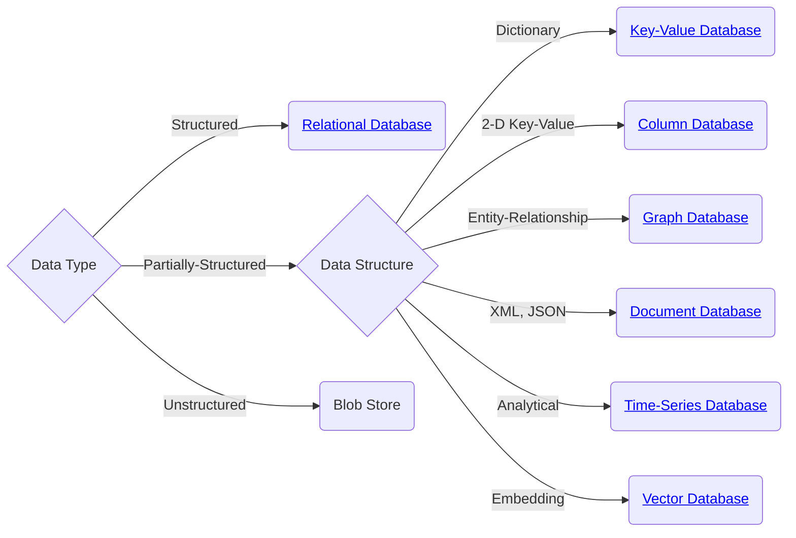

# Glossary

Some general ideas about databases and how to choose the right one

## Decision Tree

```mermaid
graph LR

A{Data Type}
A --Structured--> B(<a href="./rdbms">Relational Database</a>)
A --Partially-Structured--> C{Data Structure}
  C --Dictionary--> E(<a href="./key-value">Key-Value Database</a>)
  C --2-D Key-Value--> F(<a href="./column">Column Database</a>)
  C --Entity-Relationship--> G(<a href="./graph">Graph Database</a>)
  C --XML, JSON--> H(<a href="./document">Document Database</a>)
  C --Analytical--> I(<a href="./time-series">Time-Series Database</a>)
  C --Embedding--> J(<a href="./vector">Vector Database</a>)
A --Unstructured--> D(Blob Store)
```

## References

- [DB-Engines](https://db-engines.com)
- [Database of Databases](https://dbdb.io)
