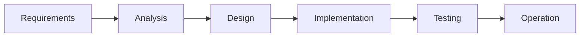

# 🔁 SDLC

How to choose the right <abbr title="System Development Life Cycle">SDLC</abbr> for your project.

## [Waterfall Model](https://en.wikipedia.org/wiki/Waterfall_model)

Development is seen as flowing steadily downwards through multiple phases. One phase must be completed before the next phase can begin.

### Pros

- **Easy to Manage**: Phases are clearly defined therefore easy to track and manage.
- **Structured Approach**: Each phase has specific deliverables and a review process.
- **Documentation**: Extensive documentation ensures that all aspects are well-documented.

### Cons

- **Efficiency**: Generally slower than other models.
- **Inflexible**: Difficult to accommodate changes.
- **Economically risky**: Errors found late in the process can be costly and time-consuming to fix.
- **Delayed Testing**: Testing phase comes only after the development phase, leading to potential delays in identifying issues.

<abbr title="United States Department of Defense">USDoD</abbr> now prefers more iterative and incremental development starting with MIL-STD-498.

## [Spiral Model](https://en.wikipedia.org/wiki/Spiral_model)

TODO

## [Agile Development](https://en.wikipedia.org/wiki/Agile_software_development)

TODO

https://notes.joschua.io/50-Slipbox/Software-release-life-cycle-(Software-versions)
