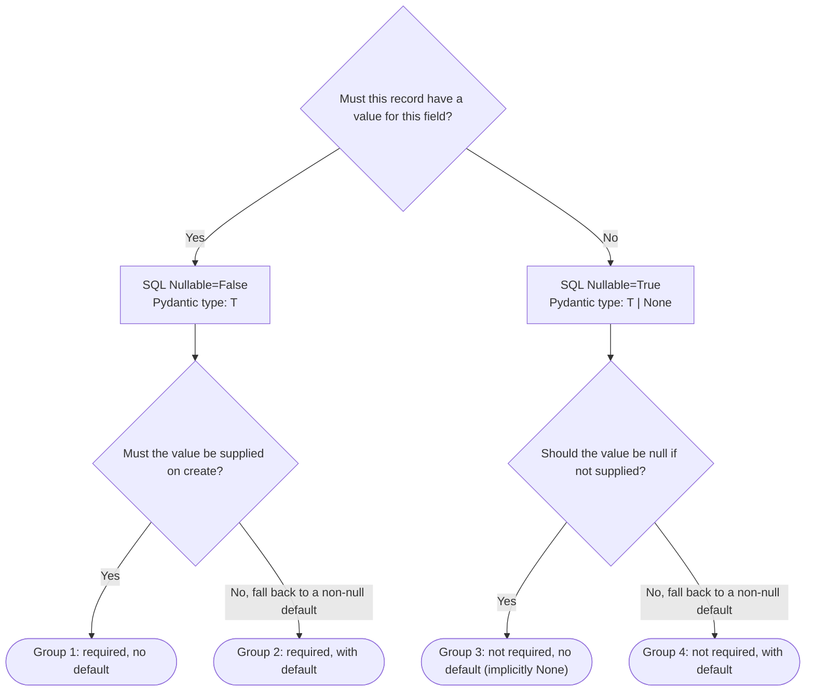

# SQLModel

Follow the [SQLModel + FastAPI tutorial pattern](https://sqlmodel.tiangolo.com/tutorial/fastapi/multiple-models/): each aggregate module defines a `Base` data class plus `table` / `Create` / `Read` (and sometimes `Update`) variants.

- `<Name>Base(SQLModel)`: data-only. Fields shared by create input and read output. Excludes `id`, server-derived fields, and `sa_column` directives.
- `<Name>(<Name>Base, table=True)`: the SQLAlchemy table. Adds `id`, relationships, server-derived columns, `__table_args__`, and `sa_column` overrides.
- `<Name>Create(<Name>Base)`: usually just `pass`. If `Create` needs to omit fields, those fields don't belong in `Base`, move them to the table class.
- `<Name>Read(<Name>Base)`: adds `id: int` (required) and any server-derived field readers should see.
- `<Name>Update(SQLModel)`: partial update. Inherits from `SQLModel` directly (every field becomes optional). Only add when the resource supports PATCH.

## TL;DR Example



The example below has one column per shape:

{/* TODO: float, bytes, datetime.date, datetime.time, datetime.timedelta. uuid.UUID */}

| Column | Group | SQL Nullable | Type                              | Pydantic Default  | Remarks                               |
| ------ | ----- | ------------ | --------------------------------- | ----------------- | ------------------------------------- |
| `id`   | 5     | `False`      | `int`                             | SQL sequence      |                                       |
| `a`    | 1     | `False`      | `int`                             | -                 |                                       |
| `b`    | 2     | `False`      | `int`                             | `0`               |                                       |
| `c`    | 3     | `True`       | `int \| None`                     | `None`            |                                       |
| `d`    | 4     | `True`       | `int \| None`                     | `0`               |                                       |
| `e`    | 1     | `False`      | naive `datetime`                  | -                 |                                       |
| `f`    | 2     | `False`      | naive `datetime`                  | `datetime.utcnow` |                                       |
| `g`    | 3     | `True`       | naive `datetime \| None`          | `None`            |                                       |
| `h`    | 4     | `True`       | naive `datetime \| None`          | `datetime.utcnow` |                                       |
| `i`    | 1     | `False`      | timezone-aware `datetime`         | -                 |                                       |
| `j`    | 2     | `False`      | timezone-aware `datetime`         | `datetime.utcnow` |                                       |
| `k`    | 3     | `True`       | timezone-aware `datetime \| None` | `None`            |                                       |
| `l`    | 4     | `True`       | timezone-aware `datetime \| None` | `datetime.utcnow` |                                       |
| `m`    | 1     | `False`      | `Decimal`                         | -                 |                                       |
| `n`    | 2     | `False`      | `Decimal`                         | `0`               |                                       |
| `o`    | 3     | `True`       | `Decimal \| None`                 | `None`            |                                       |
| `p`    | 4     | `True`       | `Decimal \| None`                 | `0`               |                                       |
| `q`    | 1     | `False`      | `Enum`                            | -                 |                                       |
| `r`    | 2     | `False`      | `Enum`                            | `Draft`           |                                       |
| `s`    | 3     | `True`       | `Enum \| None`                    | `None`            |                                       |
| `t`    | 4     | `True`       | `Enum \| None`                    | `Draft`           |                                       |
| `u`    | 1     | `False`      | `int`                             | -                 | Required foreign key                  |
| `v`    | 4     | `True`       | `int \| None`                     | `None`            | Optional foreign key                  |
| `w`    | 1     | `False`      | `int`                             | -                 | Required self-referential foreign key |
| `x`    | 4     | `True`       | `int \| None`                     | `None`            | Optional self-referential foreign key |

```python
import enum
from datetime import UTC, datetime
from decimal import Decimal
from typing import TYPE_CHECKING, Optional

import sqlmodel
from sqlmodel import Column, DateTime, Field, Relationship, SQLModel, UniqueConstraint

if TYPE_CHECKING:
    from myapp.schemas.fxample import Fxample


class ExampleStatus(enum.Enum):
    Draft = "Draft"
    Active = "Active"
    Archived = "Archived"


class ExampleBase(SQLModel):
    # int across 4 groups
    a: int
    b: int = 0
    c: int | None = None
    d: int | None = 0

    # naive datetime across 4 groups
    e: datetime
    f: datetime = Field(default_factory=datetime.now)
    g: datetime | None = None
    h: datetime | None = Field(default_factory=datetime.now)

    # timezone-aware datetime across 4 groups (table class re-declares with sa_column)
    # `sa_column` bypasses nullability inference, so should explicitly add `nullable=`.
    i: datetime = Field(sa_column=Column(DateTime(timezone=True), nullable=False))
    j: datetime = Field(
        default_factory=lambda: datetime.now(UTC),
        sa_column=Column(DateTime(timezone=True), nullable=False),
    )
    k: datetime | None = Field(
        default=None, sa_column=Column(DateTime(timezone=True), nullable=True)
    )
    l: datetime | None = Field(
        default_factory=lambda: datetime.now(UTC),
        sa_column=Column(DateTime(timezone=True), nullable=True),
    )

    # Decimal across 4 groups (default mapping to NUMERIC; no sa_column override needed)
    m: Decimal
    n: Decimal = Decimal(0)
    o: Decimal | None = None
    p: Decimal | None = Decimal(0)

    # Enum across 4 groups
    # `sa_column` bypasses nullability inference, so should explicitly add `nullable=`.
    q: ExampleStatus = Field(
        sa_column=Column(sqlmodel.Enum(ExampleStatus), nullable=False),
    )
    r: ExampleStatus = Field(
        default=ExampleStatus.Draft,
        sa_column=Column(sqlmodel.Enum(ExampleStatus), nullable=False),
    )
    s: ExampleStatus | None = Field(
        default=None,
        sa_column=Column(sqlmodel.Enum(ExampleStatus), nullable=True),
    )
    t: ExampleStatus | None = Field(
        default=ExampleStatus.Draft,
        sa_column=Column(sqlmodel.Enum(ExampleStatus), nullable=True),
    )

    # Foreign keys
    u: int = Field(foreign_key="fxample.id")
    v: int | None = Field(default=None, foreign_key="fxample.id")

    # Self-referential foreign keys
    w: int = Field(foreign_key="example.id")
    x: int | None = Field(default=None, foreign_key="example.id")


class Example(ExampleBase, table=True):
    __tablename__ = "example"
    __table_args__ = (UniqueConstraint("a", "b", name="example_a_b_key"),)

    id: int | None = Field(primary_key=True, default=None)

    # Relationships live only on the table class.
    # When multiple FKs point to the same table, `foreign_keys` must disambiguate.
    fxample: "Fxample" = Relationship(
        back_populates="examples",
        sa_relationship_kwargs={"foreign_keys": "[Example.u]"},
    )
    fxample_optional: Optional["Fxample"] = Relationship(
        back_populates="examples_optional",
        sa_relationship_kwargs={"foreign_keys": "[Example.v]"},
    )
    parent: "Example" = Relationship(
        back_populates="children",
        sa_relationship_kwargs={
            "remote_side": "Example.id",
            "foreign_keys": "[Example.w]",
        },
    )
    parent_optional: Optional["Example"] = Relationship(
        back_populates="children_optional",
        sa_relationship_kwargs={
            "remote_side": "Example.id",
            "foreign_keys": "[Example.x]",
        },
    )
    children: list["Example"] = Relationship(
        back_populates="parent",
        sa_relationship_kwargs={"foreign_keys": "[Example.w]"},
    )
    children_optional: list["Example"] = Relationship(
        back_populates="parent_optional",
        sa_relationship_kwargs={"foreign_keys": "[Example.x]"},
    )


class ExampleCreate(ExampleBase):
    pass


class ExampleRead(ExampleBase):
    # Re-defined all required fields that have default value (group 2)
    # because defining default values make the field not required in Pydantic, but once
    # the value is populated, they are guarenteed to present

    b: int

    f: datetime

    j: datetime

    n: Decimal

    r: ExampleStatus

    id: int  # Including the primary key


class ExampleUpdate(SQLModel):  # Note that this does NOT inherit from ExampleBase
    # all fields are customizable / optional, defined only the fields that are allowed to modify
    a: int | None = None
    b: int | None = None
    e: datetime | None = None
    f: datetime | None = None
    i: datetime | None = None
    j: datetime | None = None
    q: ExampleStatus | None = None
    r: ExampleStatus | None = None
```

## Assumptions

This section outlines all the assumptions made when creating the above example. Also explains some key principles.

### The purpose of `NULL`

- 99% of the time, `NULL` should be treated as "absence of a value"; "We don't know/care".
- ❌ Using `NULL` as a stand-in for a specific named state (`"never expires"`, `"approved"`, `"inherit"`)
- ✅ Name the state with an enum, sentinel, or boolean-plus-value instead.
- It makes total sense for a client to explicitly supply `NULL` when they mean "no value", while leaving some other fields absent because they don't care, want to use default.

### Nullability & Default

- Nullability

> a statement about whether a column accept "no value" as a legitimate value.

- Default

> a convenience for the writer, fires only when the field is absent. It does not imply nullability.

- All defaults are applied at Pydantic level, rather than SQL level.
- In SQL, nullability & default are independent concepts.
- In Pydantic, nullability is strictly controlled by default value: "have default" = "not required", and vice versa.
- When a field is not required, but has no default, it will implicitly be `NULL` in SQL = `None` when populate back.
- To achieve "Required, but still have default", move to default to the `<Name>Create` subclass.

According to the above, here's all the possible group combinations:

| Group | Pydantic types | Pydantic default           | SQL nullability  | SQL default  | Example                                            |
| ----- | -------------- | -------------------------- | ---------------- | ------------ | -------------------------------------------------- |
| 1     | `T`            | Required, no default       | `Nullable=False` | No default   | Name                                               |
| 2     | `T`            | Required, with default     | `Nullable=False` | No default   | Important Timestamp (default_factory = `now`)      |
| 3     | `T \| None`    | Not required, no default   | `Nullable=True`  | No default   | Description (implicit default = `None`)            |
| 4     | `T \| None`    | Not required, with default | `Nullable=True`  | No default   | Status (default = `Draft`, but `None` is accepted) |
| 5     | `T`            | Required, no default       | `Nullable=False` | With default | Auto increase primary key                          |
| -     | `T`            | Required, with default     | `Nullable=False` | With default | (N/A)                                              |
| -     | `T \| None`    | Not required, no default   | `Nullable=True`  | With default | (N/A)                                              |
| -     | `T \| None`    | Not required, with default | `Nullable=True`  | With default | (N/A)                                              |

## Primitive types

SQLModel auto-maps these Python types to a SQL column type, so they can be declared plainly in `Base` without an `sa_column` override:

| Python               | SQL (default)                            |
| -------------------- | ---------------------------------------- |
| `int`                | `INTEGER`                                |
| `str`                | `VARCHAR`                                |
| `float`              | `FLOAT`                                  |
| `bool`               | `BOOLEAN`                                |
| `bytes`              | `LargeBinary`                            |
| `Decimal`            | `NUMERIC`                                |
| `datetime.date`      | `DATE`                                   |
| `datetime.time`      | `TIME`                                   |
| `datetime.datetime`  | `DATETIME` _(naive — no timezone)_       |
| `datetime.timedelta` | `Interval`                               |
| `uuid.UUID`          | `UUID` (Postgres) / `CHAR(32)` elsewhere |
| `enum.Enum` subclass | `Enum`                                   |

Anything else — or any case where the default mapping is wrong (timezone-aware `datetime`, `JSONB` instead of `JSON`, `String(255)` vs default `String`, custom Pydantic types, Postgres-only types like `ARRAY` / `INET`) — needs an `sa_column=Column(...)` re-declaration on the table class.
