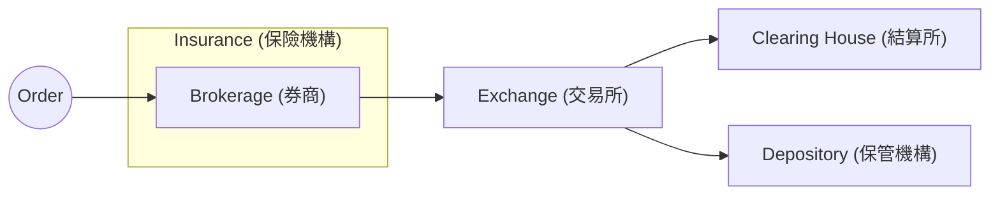

import Country from "@site/src/components/Country";

# 🏛️ 金融機構

Various financial entities involved in stock trading, including brokerages, exchanges, clearing houses, depositories, insurance institutions, and how they interact with each other.

## Overview

1. 訂單由券商接收並送至交易所。
2. 交易所在撮合買賣雙方後，將交易資訊傳送至結算所。
3. 結算所負責確認交易並進行資金與證券的交割。
4. 保管機構負責持有並管理投資者的證券。
5. 保險機構提供資產保險，保障投資者的安全。

## 交易所

### 股票

- <Country iso="tw" name={false} /> 臺灣證券交易所 (TWSE)
- <Country iso="tw" name={false} /> 證券櫃檯買賣中心 (TPEx)
- <Country iso="us" name={false} />
  <abbr title="New York Stock Exchange">NYSE</abbr>
- <Country iso="us" name={false} /> NASDAQ

### 選擇權

- <Country iso="tw" name={false} /> 臺灣期貨交易所 (TAIFEX)
- <Country iso="us" name={false} />
  <abbr title="Chicago Board Options Exchange">CBOE</abbr>
- <Country iso="us" name={false} />
  <abbr title="NASDAQ Options Market">NOM</abbr>
- <Country iso="us" name={false} /> NYSE Arca Options

### 期貨

- <Country iso="tw" name={false} /> 臺灣期貨交易所 (TAIFEX)
- <Country iso="us" name={false} />
  <abbr title="Chicago Mercantile Exchange">CME</abbr>
- <Country iso="us" name={false} />
  <abbr title="Intercontinental Exchange">ICE</abbr>
- <Country iso="us" name={false} />
  <abbr title="New York Mercantile Exchange">NYMEX</abbr>

## 結算所

### 股票

- <Country iso="tw" name={false} /> 台灣集保結算所 (TDCC)
- <Country iso="us" name={false} />
  <abbr title="National Securities Clearing Corporation">NSCC</abbr>
  (under <abbr title="Depository Trust & Clearing Corporation">DTCC</abbr>)

### 選擇權

- <Country iso="tw" name={false} /> 臺灣期貨交易所 (TAIFEX)
- <Country iso="us" name={false} />
  <abbr title="Options Clearing Corporation">OCC</abbr>

### 期貨

- <Country iso="tw" name={false} /> 臺灣期貨交易所 (TAIFEX)
- <Country iso="us" name={false} /> CME Clearing
- <Country iso="us" name={false} /> ICE Clear

## 保管機構

- <Country iso="tw" name={false} /> 台灣集保結算所 (TDCC)
- <Country iso="us" name={false} />
  <abbr title="Depository Trust Company">DTC</abbr>
  (under <abbr title="Depository Trust & Clearing Corporation">DTCC</abbr>)

## 保險機構

- <Country iso="tw" name={false} /> 投資人保護中心 (SFIPC)
- <Country iso="us" name={false} />
  <abbr title="Securities Investor Protection Corporation">SIPC</abbr>

## 存款保險公司

- <Country iso="tw" name={false} /> 中央存款保險公司 (CDIC)
- <Country iso="us" name={false} />
  <abbr title="Federal Deposit Insurance Corporation">FDIC</abbr>
