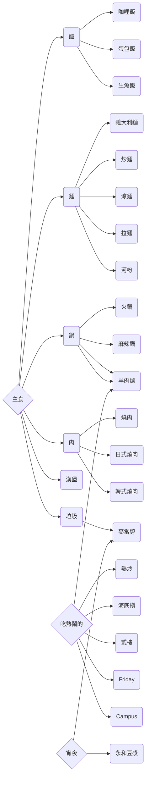

# 吃啥

世上有多少千古難題，都可以用分類樹來解決

```mermaid
graph LR

A{主食}
A --> B(飯)
  B --> F(咖哩飯)
  B --> G(蛋包飯)
  B --> H(生魚飯)
A --> C(麵)
  C --> I(義大利麵)
  C --> J(炒麵)
  C --> K(涼麵)
  C --> S(拉麵)
  C --> Z(河粉)
A --> D(鍋)
  D --> L(火鍋)
  D --> M(麻辣鍋)
  D --> N(壽喜燒)
  D --> N(羊肉爐)
A --> E(肉)
  E --> O(燒肉)
  E --> P(日式燒肉)
  E --> Q(韓式燒肉)
A --> R(漢堡)
A --> AB(垃圾)
  AB --> AC(麥當勞)

T{吃熱鬧的}
  T --> U(熱炒)
  T --> V(海底撈)
  T --> W(貳樓)
  T --> X(Friday)
  T --> Y(Campus)
  T --> N

AA{宵夜}
  AA --> AC
  AA --> AD(永和豆漿)
```
