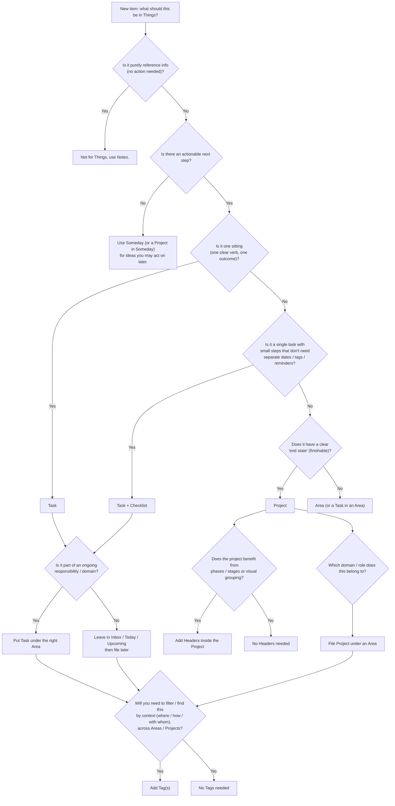

# 📋 Things

A opinionated mindset for organizing tasks in Things.

## Task

- A single actionable item that you can complete in one sitting.
- Small, specific, and self-contained.
- Should be achievable within a short time frame (e.g., a day or less).

e.g. Buy groceries, Call mom, Write blog post

## Checklist

- A sub-list within a task to break it down into smaller steps.
- Helps track progress on multi-step tasks without creating separate tasks for each step.
- If things get too complex, consider turn task into a project, and each checklist item into a task.

e.g. For Task "Grocery Shopping", checklist items might be "milk", "eggs", "bread".

## Project

- A group of multiple tasks toward a defined outcome, that has a clear ending, a clear definition of done.
- Once you finish all the steps, you check the project off completely and it’s archived.
- Tasks are unlikely to be routine or repetitive.
- Projects are _reviewed_, instead of _maintained_.

e.g. Plan Vacation, Write Book, Launch Website

## Header

- A way to visually separate different sections within a project (not area).
- Helps organize tasks into smaller stages or phases.
- One header should typically contain 3-10 tasks underneath it.
  - To few, it should just be a task with a few checklist items.
  - To many, consider breaking it into multiple headers or projects.

e.g. For Project "Plan Vacation", you might have headers like "Research", "Booking", "Pack List".

## Area

- A major _concept_ used to bucket / group items (tasks and projects) together.
- Items may end, but the _concept_ or domain itself have no deadline and never really ends.
- Represent roles or long-standing categories in life.
- Good place to put recurring tasks.
- Areas are _maintained_, instead of _reviewed_.

e.g. Work, Personal, Health, Hobbies

## Tag

- A minor _concept_ or cross-cutting metadata to help filter, find and organize tasks across realms.
- Can represent contexts, priorities, locations, states, or any other attribute.
- Think about When, Where, Why, and How will you need to find a task later.
- A task should typically have at most 5 tags, and should not have tag same as its Area or Project.

e.g. urgent, trader-joe, waiting

## Decision Tree

