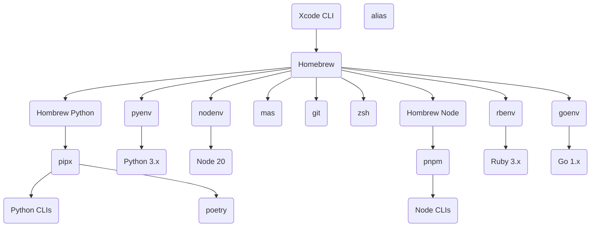

# Setup

How my Mac is setup.

## Hierarchy

There are mainly three artifacts:

### Applications / CLIs

GUI Applications and Command line tools.

Install method ordered by preference:

- [Homebrew](https://brew.sh/)
- Mac App Store: Manually login to the Mac App Store and batch install all the apps with [`mas`](https://github.com/mas-cli/mas) CLI.
- Setapp: Manually install all necessary apps.
- DMG: Download and install the app mounted from the `.dmg` file.
- PKG Installer: Download and execute the `.pkg` installer. **Be careful when password is prompted.**

<details>

<summary>Install Homebrew on multi-user machine</summary>

```shell
sudo dseditgroup -o create brew
sudo dseditgroup -o edit -a tomy0000000 -t user brew
sudo chgrp -R brew $(brew --prefix)/*
sudo chmod -R g+w $(brew --prefix)/*
```

</details>

### Data

Files, Documents, and other user data.

Handled by Dropbox.

### Preferences / Configurations

System Preferences, Application Preferences, and Configuration files.

Managed by:

- [`mackup`](https://github.com/lra/mackup) CLI
- [dotfiles repo](https://github.com/tomy0000000/dotfiles)

:::note

Some preferences and configurations are stored in the Dropbox folder.

:::

#### List of Preferences

- Keyboard Shortcuts

## Dependency Graph


