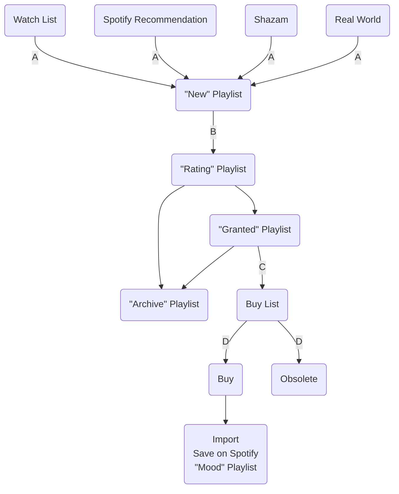

# 💿 Music Album

## Lifecycle

### Weekly batch process

- A
- B
- C
- D
- Buy List organization
  - Input all albums to buy
  - Fetch prices by merchants

## Import to Library

1. Ripping (FLAC, 16bit, 44.1kHz)
2. Prepare [Metadata](#metadata)
3. Artwork (3000px x 3000px)
4. Rename Files (`{Disc Number}-{Track Number} - {Title}`)
5. Rename Folder (`{Album Artist} - {Album} ({Release Year})`)

Regarding rename:

- `Disc Number` and `Track Number` are zero-padded to 2 digits
- There might be multiple Album Artists, choose the main one only
- Make sure the name is sanitized and compatible with all file systems (macOS, NTFS, SMB, CIFS, etc.)

## Metadata

| Group | Field Name               | Multiple | MP4       | Vorbis               | ID3v2.4 | Notes                                                                                    |
| ----- | ------------------------ | -------- | --------- | -------------------- | ------- | ---------------------------------------------------------------------------------------- |
| Album | Album                    | ❌       | `\xa9alb` | `ALBUM`              | `TALB`  |                                                                                          |
| Album | Album Artist             | ✅       | `aART`    | `ALBUMARTIST`        |         |                                                                                          |
| Album | Discs                    | ❌       | `disk`    | `DISCTOTAL`          |         | Total number of disc in the album                                                        |
| Album | Tracks                   | ❌       | `trkn`    | `TRACKTOTAL`         |         | Total number of track in the disc                                                        |
| Album | Year                     | ❌       | `\xa9day` | `DATE`               |         | Release Year                                                                             |
| Album | Release Time             | ❌       | `\xa9day` | `RELEASETIME`        | `TDRL`  | Precision to date, e.g. `2023-08-10T00:00:00-04:00`                                      |
| Album | Compilation              | ❌       | `cpil`    | `PARTOFACOMPILATION` |         |                                                                                          |
| Album | Album Explicitness/Clean | ✅       |           |                      |         | iTunes custom tag, only supported in MP4 None = [0], Clean = [2], Explicit = [4][^1] |
| Album | Publisher                | ❌       |           | `LABEL`              | `TPUB`  |                                                                                          |
| Album | Copyright                | ❌       | `cprt`    | `COPYRIGHT`          | `TCOP`  |                                                                                          |
| Album | Credits                  |          |           | `MUSICIANCREDITS`    |         | Mapping of instruments to artists                                                        |
| Album | Spotify Album ID         | ✅       |           |                      |         | Custom field                                                                             |
| Track | Title                    | ❌       | `\xa9nam` | `TITLE`              | `TIT2`  |                                                                                          |
| Track | Artist                   | ✅       | `\xa9ART` | `ARTIST`             |         |                                                                                          |
| Track | Disc Number              | ❌       | `disk`    | `DISCNUMBER`         |         |                                                                                          |
| Track | Track Number             | ❌       | `trkn`    | `TRACKNUMBER`        | `TRCK`  |                                                                                          |
| Track | Track Explicitness/Clean | ✅       | `rtng`    |                      |         | iTunes custom tag, only supported in MP4 None = [0], Clean = [2], Explicit = [4][^1] |
| Track | Genre                    |          | `\xa9gen` | `GENRE`              |         | See the list of [genre](#genres)                                                         |
| Track | Composer                 | ✅       | `\xa9wrt` | `COMPOSER`           | `TCOM`  | Also denote as 作曲;                                                                     |
| Track | Lyricist                 | ✅       |           | `LYRICIST`           | `TEXT`  | Also denote as 作詞; Written By                                                          |
| Track | Arranger                 | ✅       |           |                      |         | Also denote as 編曲; Arranged By                                                         |
| Track | Producer                 | ✅       |           |                      |         | Also denote as 製作人                                                                    |
| Track | Language                 |          |           | `LANGUAGE`           | `TLAN`  |                                                                                          |
| Track | Lyrics                   | ❌       | `\xa9lyr` | `LYRICS`             | `USLT`  |                                                                                          |

[^1]: [Stack Overflow](https://stackoverflow.com/a/43309195/10325430)

## Genres

TODO

## Future Work

- Add support for linking to MusicBrainz, Discogs, Spotify, Apple Music
- Add support for multiple artists (e.g. `TPE1`, `TPE2`, `TPE3`, `TPE4`)
- Add support for Remix and Cover (`TCON`)
- Add support for ISRC (`TSRC`)
- Add support for Synchronised lyrics (Section 4.9)

## References

- [Mutagen MP4 Reference](https://mutagen.readthedocs.io/en/latest/api/mp4.html#mutagen.mp4.MP4Tags)
- [Vorbis Comment](https://xiph.org/vorbis/doc/v-comment.html)
- [id3v2.4.0-frames - ID3.org](https://web.archive.org/web/20220903174949/https://id3.org/id3v2.4.0-frames)
- [Mapping of Properties to Various Formats (TagLib)](https://taglib.org/api/p_propertymapping.html)
