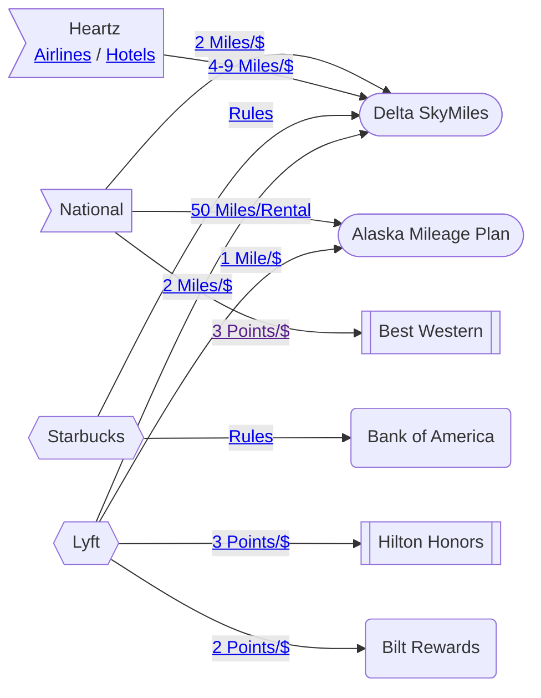

# 🗺️ Mileage Map

How does miles accumulate and flow between different accounts?

TODO: This is a huge projects that require investigations on how to scale this chart.

:::tip

Click on box to visit rule pages

:::

### [Starbucks → Delta](https://www.deltastarbucks.com/) {#STARBUCKS-DL}

- Double Stars on Delta travel day
- Earn stars on reload

| Reload | Miles |
| ------ | ----- |
| $25+   | 25    |
| $50+   | 75    |
| $75+   | 125   |
| $100+  | 200   |

### [Starbucks → Bank of America](https://promotions.bankofamerica.com/starbucks) {#STARBUCKS-BOA}

- 1 Bonus Star per $2
- 2% Cash Back
